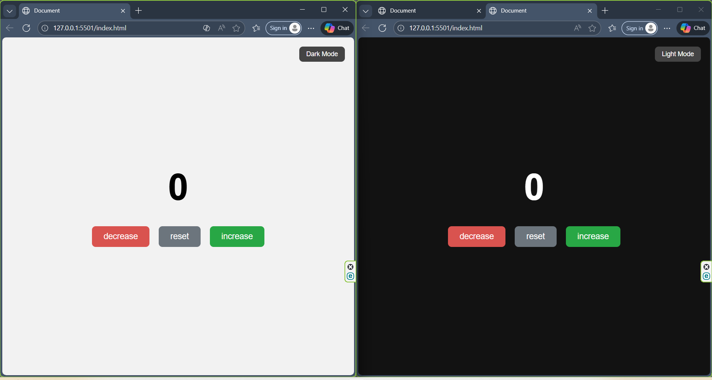

# 🧮 Counter App with Dark Mode

A simple, interactive, and modern **Counter Web Application** made using **HTML, CSS, and JavaScript** — featuring Dark Mode, smooth animations, and a clean UI.

---

## 📌 Features

### 🔢 Counter Functions
- Increase the counter  
- Decrease the counter  
- Reset to zero  
- Real-time display updates  

### 🌙 Dark Mode / ☀️ Light Mode
- Toggle between dark and light themes  
- Smooth color transitions  
- Adjustable from a single button  

### 🎨 Modern UI
- Clean, centered layout  
- Color-coded buttons  
- Hover & click animations

## 📷 Screenshot

---
